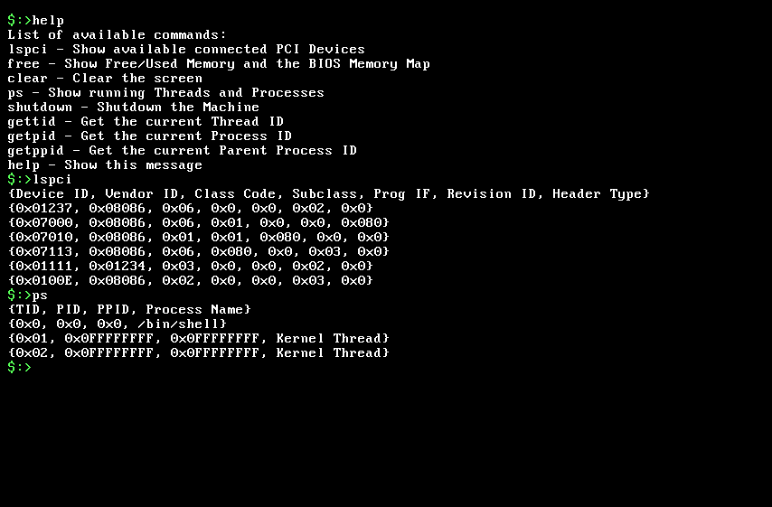
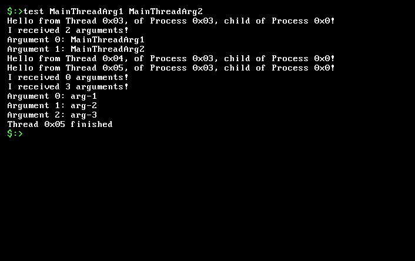

# KhhraspokOS

Tiny hobbyist *nix Multithreaded 64-bit Operating System with SMP support that I
wrote in order to get a better understanding of Operating Systems.
The OS begins by loading a Userspace Shell that you can use to pass various
commands:



Some of the features:
- SMP support
- Multithreaded Kernelspace
- Preemptive Round-robin Scheduler
- PCI Configuration Space Enumeration
- Page Frame Allocator
- ATA, PS/2 Keyboard and VGA Text Mode drivers
- Basic FAT16 and Virtual Filesystem (reading files)
- Some System Calls
- ELF64 Loader
- Custom 2 Stage Bootloader
- The Multithreaded Userspace can create its own threads through the available
API. For example, this [test](https://github.com/mogasergiu/KhhraspokOS/blob/main/src/user/programs/test.cpp)
creates two user threads. In order to get the Shell to load the final ELF64
simply call the binary by its name, and the Kernel will search through its
internal filesystem and create the new task:



Waiting for a thread to finish is entirely optional, as the Kernel's Reaper Thread
is constantly on the lookout for threads whose spawner is dead.
- Static TLS support

# How to build

You must first ensure you have `qemu` and `nasm` installed.

### Get the toolchain
You will have to make sure you have installed the same `toolchain` that Khhraspok
was built with:

```
./kpk.sh toolchain
```

This will download to `/tmp` all of the required resources and build them in
`${HOME}/opt/cross`. This process is going to take quite a while.

### Build the OS!

```
./kpk.sh build
```

This will ask for elevated privileges when it will attempt to mount the OS so that
it can make the Userspace programs available at runtime. (It copies everything in
`${KHH_HOME}/bin/user/` to where the OS is mounted - at `/mnt/kpk/` - and then unmounts the OS).

### Run the OS!

```
./kpk.sh run
```

